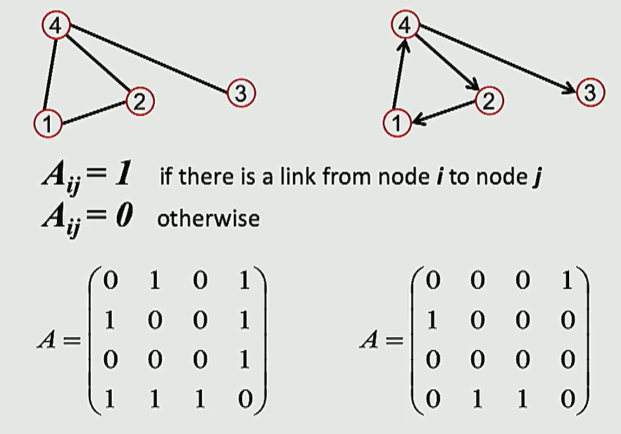

# Introdutcion Structure of Graphs(CSS224W 图机器学习)

## 🌎关于网络的一些直观认识
### 图的两种类型
+ 网络(或者称为自然图)
   + 人类社会网络
   + 神经科学

+ 信息图
   + 信息/知识被连接或者组织起来
   + 场景图
   + 相似网络

	

&ensp;&ensp;&ensp;&ensp;在很多复杂领域(如知识, 文本, 图片等等)拥有丰富的关系结构,他们可以被表示成关系图.通过显式的对这些关系建模我们就可以得到更好的模型和更优的性能去更好地解决问题. 

---

### 网络的应用
+ Facebook社交图:  

	

+ 社交圈检测:  

	

---

### [课程主页](http://cs224w.stanford.edu)
+ 课程讲义
+ 相关论文

---

## 🌎网络的结构
&ensp;&ensp;&ensp;&ensp;网络是一个对象集合, 其中有一些对象对相互链接或相互作用.

---
### 网络的基本构成
+ 对象(Object): 节点(nodes), 顶点(vertices)&nbsp;&nbsp;&nbsp;$N$
+ 交互(Interations): 连接(link), 边(edges)&nbsp;&nbsp;&nbsp;&nbsp;&nbsp;&nbsp;$E$
+ 系统(System): 网络(network), 图(graph)&nbsp;&nbsp;&nbsp;&nbsp;$G(N,E)$

---

### 网络和图的区别

+ 网络常被用来表示一个真实的系统
   + 社交网络, 代谢网络
   + 在网络中其组成元素的称谓: 网络(Network), 节点(Node), 连接(Link)

+ 图是一个网络的数学表示
   + 网络图(Web graph), 社交图(Social graph), 知识图(Knowledge graph)
   + 在网络中其组成元素的称谓: 图(Graph), 顶点(Vertex), 边(Edge)

---

### 无向图与有向图
+ 无向图:  

	

+ 有向图:  

	

---

### 节点度
+ 无向图
   + 节点度: 与节点相邻的边数
   + 平均节点度: 
$$\overline{k} =  <k> = \sum_{i}^{N}{k_{i}} = \frac{2E}{N}$$
&ensp;&ensp;&ensp;&ensp;(E-图的边数, N-图的顶点数)

+ 有向图
   + 出度($k^{in}$): 从当前节点指向其他节点的边的数目
   + 入度($k^{out}$): 其他节点指向当前节点的边的数目
   $$\overline{k} = \frac{E}{N}$$
   $$\overline{k}^{in} = \overline{k}^{out}$$

### 完全图(Completed Graph)
&ensp;&ensp;&ensp;&ensp;图中任意节点两两互相连接的图成为无向完全图. 无向完全图中的边数为:
$E = \frac{N(N-1)}{2}$, 其平均度$<k>$为$N-1$. 

	

---

### 二分图(Bipartile Graph)
&ensp;&ensp;&ensp;&ensp;给定图$G = (V, E)$, 如果顶点集$V$可分为两个互不相交的非空子集X和Y, 并且图中的每条边$(i, j)$的两个端点$i$和$j$分别属于这两个不同的顶点子集, 那么就称图G为一个二分图.

---

### 图的表示: 邻接矩阵(Adjacency Matrix)

	

+ 无向图邻接矩阵性质:
$$A_{ij} = A_{ji}$$
$$A_{ii} = 0$$
$$k_i = \sum_{j}^{N}A_{ij}$$
$$k_j = \sum_{i}^{N}A_{ij}$$

+ 有向图邻接矩阵性质:
$$A_{ij} \ne A_{ji}$$
$$A_{ii} = 0$$
$$k_i^{out} = \sum_{j}^{N}A_{ij}$$
$$k_i^{in} = \sum_{i}^{N}A_{ij}$$

---

### 图的其他类型
+ 加权图
+ 自环
+ 重边

### 无向图的连通性
&ensp;&ensp;&ensp;&ensp;如果图中任意一对节点之间存在路径, 则图是连通的.
+ 从邻接矩阵看图的连通性

	

---

### 有向图的连通性
+ 强连通图的概念: 任意选择一个节点, 总存在至少一条路径通往图中的任意其他节点,反之亦然(A-B路径, B-A路径).
+ 弱连通图的概念: 将图中的所有有向边都看作是无向边后得到的无向图为连通图.
+ 强连通组件(Strongly connected components):有向图中的可以互相访问的节点构成的区域 