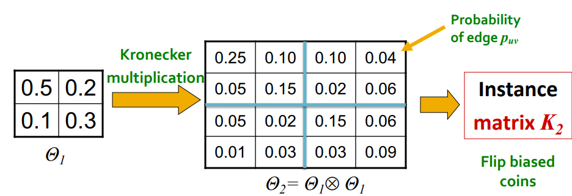

# Properties of Networks and Random Graph Models(CSS224W 图机器学习)

## 🌎图的重要性质

### 度分布(Degree Distribution)
+ 度分布$P(k)$: 随机选择一个节点, 其度为$K$的概率.<br/>
$N_k$ = # Nodes with degree $k$
+ 正则化d度分布直方图: 
$$P(k) = \frac{N_k}{N}$$

---

### 图中的路径(Path)
+ 是一个节点序列，其中每个节点都链接到下一个节点.
$$P_n = \{i_0,i_1,i_2,...,i_n\}$$
$$P_n = \{(i_0,i_1),(i_1,i_2),(i_2,i_3),...,(i_{n-1},i_n)\}$$
+ 一条路径可以自身相交并多次穿过同一条边.

---

### 图中的距离(Distance)
+ <font color=#FFB6C1>距离(最短距离, 测地距离)</font>被定义为连接节点的最短边数(若两节点不相连, 则其距离定义为无穷大或0).
+ 在<font color=#FFB6C1>有向图</font>中, 路径应循箭头的方向.

<div align=center>
	
</div>

---

### 网络直径(Network Diameter)
+ <font color=#FFB6C1>直径</font>: 图中任意节点对距离的最大值
+ 连通图或强连通图的平均路径长度:
   + $h_{ij}$-----从节点$i$到节点$j$的距离
   + $E_{max}$--无向完全图的边数
$$\overline{h} = \frac{1}{2E_{max}}\sum_{i,j\ne i}h_{ij}$$

---

### 聚类系数(Clustering Coefficient)
+ 聚类系数(对无向图而言):
   + 节点$i$的邻居之间的连通性是怎样的?
   + 节点$i$的度$k_i$
   + $C_{i} \in [0, 1]$
   + $C_i = \frac{2e_{i}}{K_i(k_i - 1)}$, $e_i$是直接相连的邻居节点的边的个数
+ 平均聚类系数:
$$C= \frac{1}{N}\sum_{i}^{N}C_i$$

---

### 连通性(Connectivity)
+ 最大连通子图
   + 任意两个存在路径的节点最大节点集合构成的子图

---

## 🌎最简单的图模型(ER Graph)
### ER(Erdos-Renyi)随机图
+ 2个变体:
   + $G_{np}$: <font color=#FFB6C1>具有固定连边连边概率的ER随机图$G(N,p)$:&ensp;在模型$G(N,p)$中不固定总的边数,而是把$N$个节点中任意两个不同的节点之间有一条边的概率固定为$p$. </font>
   + $G_{nm}$: <font color=#FFB6C1>具有固定边数的ER随机图$G(N,M)$:&ensp;假设有大量的纽扣$(N\gt\gt1)$散落在地上, 每次随机玄奇的一堆纽扣之间系上一根线.重复$M$次后就得到一个包含$N$个点,$M$条边的ER随机图.通常希望构造的是没有重边和自环的简单图,因此在每次选择节点对时应该选择两个不同的并且是没有边连接的节点对.</font>
+ $n$和$p$不唯一确定一个图
   + 图是一个随机过程的结果
+ 对于相同的$n$和$p$,可以有多种图的生成

---

### ER随机图$G(N,p)$构造算法
```
    (1). 初始化: 给定N个节点以及连边概率p∈[0,1]
    (2). 随机连边: 
        1). 选择一条没有边相连的不同的节点
        2). 生成一个随机数r∈(0,1)
        3). 如果r<p, 那么在这对节点之间添加一条边,否则就不添加
        4). 重复步骤1)~3),直至所有的节点对都被选择一次
```
+ 该算法生成的随机图的几种情形:
   + 如果$p = 0$, 那么$G(N,p)$只有一种可能, $N$个孤立节点, 边数$M=0$.
   + 如果$p = 1$, 那么$G(N,p)$也只有一种可能, $N$个节点组成的全耦合网络.
   + 如果$p\in(0,1)$,那么理论上$N$个节点生成具有任一给定的边数$M\in[0, \frac{N(N-)}{2}]$的网络都是有可能的.
---

### ER随机图$G(N,M)$构造算法
```
    (1). 初始化: 给定N个节点和待添加的边数M
    (2). 随机连边: 
        1). 选择一条没有边相连的不同的节点,并在这对节点之间添加一条边
        2). 重复步骤1),直至在M对不同的节点对之间各添加了一条边
```

---

### ER随机图$G(N,p)$的性质
+ 度分布: 图中任意给定节点与其他k个节点有边相连的概率为<font color=#FFB6C1>$p^{k}(1-p)^{N-1-k}$</font>. 共存在<font color=#FFB6C1>$\begin{pmatrix} N-1 \\ k \end{pmatrix}$</font>种选取这k个节点的方式.<font color=#FFB6C1>(注释:$(N-1)$的原因是因为当前节点和$k$个节点相连接后因与除自己以外的$(N-1-k)$个节点不连接,不减1就会导致度为$k$的节点本身也被计算进去而出现错误.)</font>
   + 网络任一给定节点的度为$k$的概率服从二项分布:
   $$p(k) = \begin{pmatrix} N-1 \\ k \end{pmatrix} p^{k}(1-p)^{N-1-k}$$
   + 度分布的均值([二项分布数学期望的证明](https://blog.csdn.net/u011240016/article/details/53213525)):
   $$<k> = p(N-1)$$
   + 度分布的方差([二项分布方差的证明](https://blog.csdn.net/u011240016/article/details/53213525)):
   $$\sigma^{2}_{k} = p(N-1)(1-p) = <k>(1-p)$$
   + 度分布的变异系数<font color=#FFB6C1>(当网络规模逐步增大的时候,度分布也变得越来越窄)</font>:
   $$\frac{\sigma_{k}}{<k>} = \sqrt{\frac{1-p}{p}\frac{1}{(N-1)}} \approx \sqrt{\frac{1}{N-1}}$$
+ $G_{np}$的聚类系数计算:
   + 由聚类系数的定义可知节点$i$的聚类系数为:
   $$C_i = \frac{2e_i}{k_i(k_i-1)}$$
   + 对邻居节点的连边数$e_i$的期望计算有如下公式($l_i$为完全图中的第$i$个边):
   $$E(e_i) = \sum_{i}^{k}l_i*p, k=\frac{k_i(k_i-1)}{2}$$  
   $$= \frac{k_i(k_i-1)}{2}p$$
   + 由上述公式得:
   $$E(C_i) = E(\frac{2e_i}{k_i(k_i-1)})$$
   $$ = \frac{E(e_i)}{k_i(k_i-1)}$$
   $$ = \frac{k_i(k_i-1)p}{k_i(k_i-1)} = p = \frac{<k>}{n-1} \approx \frac{<k>}{n} $$

---

### 扩张(Expansion):
+ 图$G(V,E)$有扩张$\alpha$: 
$$if\ \forall S\subseteq V:\ of\ egde\ leaving\ S\ \ge\alpha \cdot min(|S|, |V\setminus S|)$$
+ 等价形式:
$$\alpha = \min_{S\subseteq V}\frac{egdes\ leaving\ S}{\min(|S|, |V \setminus S|)}$$
   ```
   Nodes:
      --"egdes leaving S"的意思是指从集合{S}出发指向集合{V\S}的边的个数
      -- 关于"min(|S|, |V\S|)": 保持恒定的最小关系
      -- 选取使α最小的子集S使得其可以满足不等式关系
   ```

---

### 随机图的扩展(Expansion: Random Graphs)
+ 在拥有扩展为$\alpha$的节点个数为$N$的图中, 对所有节点对而言, 其路径长度为: $O(\frac{lnN}{\alpha})$.
+ 在ER图$G_{np}$中任取一点, 图中大约有$<k>$个其他的点与该点之间的距离为1; 大约有$<k>^2$个节点与该节点的距离为2; 以此类推, 由于网络总的节点数为$N$, 设$diam(G_{np})$ER为随机图的直径, 易得
$$N=O(<k>^{diam(G_{np})})$$
$$\Rightarrow$$
$$diam(G_{np}) = O(\frac{lnN}{ln<k>})$$

---

### 实际网络 vs. ER随机图
+ 实际网络与ER随机图相似吗?
   + ✅大连通分量
   + ✅平均路径长度
   + ❎聚类系数
   + ❎度分布
+ ER随机图模型存在的问题: 
   + ER随机图的度分布$P_{ER}(k)$与实际网络的度分布$P_{real}(k)$差别较大
   + 大多数实际网络中的巨型复合网并不是通过相变出现的
   + 无局部结构-聚类系数$C$太小
+ 虽然ER随机图对于真实世界网络而言是错误的, 但其还是有研究价值的:
   + 作为参考模型出现
   + 帮助我们计算许多指标,并与真实数据计算的指标相比较
   + 它将有助于我们了解某一特定性质在多大程度上是某种随机过程的结果

---

## 🌎小世界网络(The Small-World Model)
+ <font color=#FFB6C1>我们是否可以制造一个拥有高聚类度和低路径长度的网络?</font>

<div align=center>
	
</div>

---

### WS小世界模型(Watts-Strogtz Small-World Model)
+ WS小世界模型构造算法:
```
   (1). 从规则网络开始: 给定一个含有N个节点的环状最邻近耦合网络,其中每个节点斗鱼它左右相邻的个各K/2个节点相连, K是偶数.
   (2). 随机化重连: 以概率p随机地重新连接网络中原有的每条边, 即把每条边的一个端点保持不变, 另一个端点改取为网络中随机选择的一个节点. 其中规定不得有重边和自环.
```

<div align=center>
	
</div>
---

## 🌎Kronecker图模型(Kronecker Graph Model)
+ Kronecker图:
   + 网络结构的一个递归模型

<div align=center>
	
</div>

   + <font color=#FFB6C1>Kronecker积</font>:($A.shape=N\times M,\ B.shape=K \times L,\ C.shape = N*K \times M*L$)
   $$C = A \otimes B \approx
   \begin{pmatrix}
   a_{1,1}B&a_{1,2}B&\cdots&a_{1,m}B\\
   a_{2,1}B&a_{2,2}B&\cdots&a_{2,m}B\\
   \vdots&\vdots&\ddots&\vdots\\
   a_{n,1}B&a_{n,2}B&\cdots&a_{n,m}B
   \end{pmatrix}
   $$
   + Kronecker图是通过在起始矩阵上迭代Kronecker积得到的.
   $$K^{[m]}{1} = K_m = K_1\otimes K_1\cdots K_1 = K_{m-1}\otimes K_1$$
   
<div align=center>
	
</div>

+ 随机Kronecker图(Stochastic Kronecker Graphs)
   + 创建一个$N_1\times N_1$的概率矩阵$\Theta_1$
   + 计算第$k$个Kronecker的幂$\Theta_k$
   + 对于递归生成的Kronecker图$K_k$,其邻接矩阵中位置为$(u, v)$的元素表示节点$u,v$在图中相连的概率$p_{uv}$

<div align=center>
	
</div>

   + 对于是否要对两个节点进行连接, 这就像投掷一个不均匀的骰子一样, 当图的节点$n$越来越大时, 投掷的次数会增长$(n^2)$,计算速度下降.
+ 快速Kronecker生成步骤:
   + 确定图的实例$K$和边数$E$
   + 递归的在$P_1$选择元素,每个元素$(i,j)$被选择的概率为$\theta_{ij}/\sum_{ij}\theta_{ij}$,经过$k$次, 在第$k$层的$(i,j)$处插入一条边
   + 重复执行上一步骤, 经过$E$次后停止