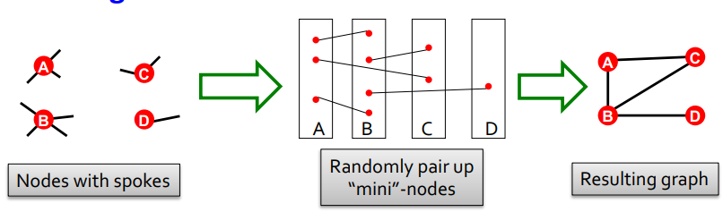
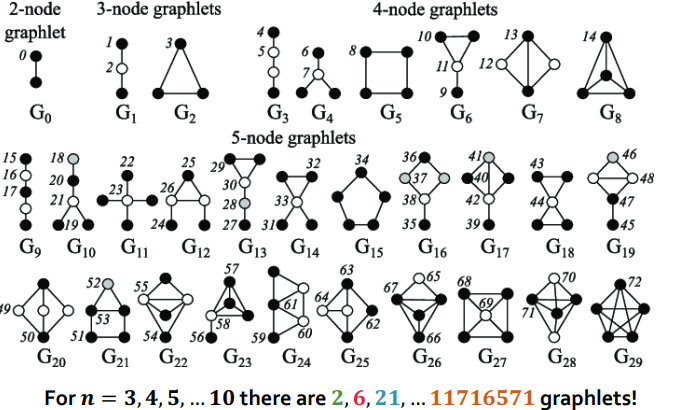
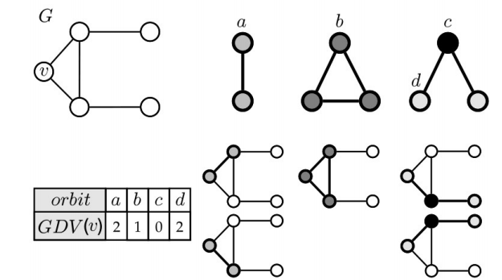

# Motifs and Structural Roles in Networks(CS224W 图机器学习)
## 🌎子图(Subgraphs), 主题(Motifs)和Graphlets
### 网络的主题
+ 反复出现的, 重要的互联模式
+ 如何定义一个网络的主题:
   + 模式(Parrtern): 小的诱导子图(induced subgraphs)
   + 反复的(Recurring): 在网络中高频率的反复出现
   + 重要的(Significant): 在随机生成的途中的出现次数高于期望
+ 主题的作用
    + 主题可以帮助我们对网络如何工作做出认知
    + 主题可以帮助我们预测网络在特定情况下的运行和反应
+ 图中的主题在与随机网络进行比较时出现下述情况时表示该主题出现了过度代表(overrepresented)的现象:
   + $Z_i$获取的是某个主题$i$的统计显著性:
   $$Z_i = \frac{N_{i}^{real} - N_{i}^{rand}}{std(N^{real}_{i}}$$
   + $N^{real}_{i}$为真实图$G^{real}$中是类型为$i$的子图的个数
   + $N^{rand}_{i}$为随机图$G^{rand}$中是类型为$i$的子图的个数
   + 网络显著性描述(Network significance profile, SP):

   $$SP_i = Z_i/ \sqrt{\sum_{j}Z^2_j}$$
   
---
### 配置模型(Configuration Model)
+ 通过给定度序列$K_1,K_2,...,K_N$来生成上述所需的随机图
+ 因为随机图和真实图都拥有相同的度分布,所以我们可以使用随机图与真实图来进行比较.

	

+ 上图中节点$B$的度在生成随机图后不同于原来的度分布,这是由于节点的$A,B$之间出现了重边,但在实际生成过程中由于度的分布序列集合很大,所以对于偶尔的度缺失是可以接受的.

    

+ 上图显示当网络有用相似的结构时,其不同主题的统计显著性是相似的.

---

## 🌎Graphlets: 节点特征向量(Graphlets: Node feature vectors)
+ Graphlets: 连通的异构子图

    

+ Graphlet度向量(Graphlet Degree Vector, GDV): 当前节点$v$所接触的graphlets的个数所构成的向量.

    

 
+ GDV提供一种节点本地网络拓扑的度量方式
   + 两个节点的比较向量提供了一种高度约束的局部拓扑相似性度量

---

## 🌎寻找主题和Graphlets
+ $EnumerateSubgraphs(ESU)$算法

    

+ 对$ESU$算法的几点注释:
   + $Step\ 02$: N({v})$表示集合中元素$v$的邻居(Neighborhood)节点
   + $Step\ 02$: $u>v$是为了不重复取大小为$k$的子图
   + $Step\ E3$: 从$V_{Extension}$移除任一元素的过程可以选择按元素在集合中的顺序进行移除
   + $Step\ E4$: $N_{excl}(w, V_{Subgraph})$表示的是只属于节点$w$的邻居节点, 节点集合$V_{Subgraph}$及节点集合$V_{Subgraph}$的邻居节点集合$N(V_{Subgraph})$都不能被包含在其中. 
      + 这是扩展子图的一个过程, 扩展子图时需要剔除已经存在的节点$V_{Subgraph}$和节点$w$本身.
   $$N_{excl}(w, V_{Subgraph}) = N(w)\setminus (V_{Subgraph} \cup N(V_{Subgraph}))$$

   

    
   

+ 在生成子图后, 对同构的子图进行合并,最终得到 $k$-$nodes\ graphlets$.

---

## 🌎网络中的结构规则(Structural Roles in Networks)
### 图规则相关概念:
 + 规则(role): 在网络中具有相似位置的节点的集合
    + 具有相同规则的节点不需要彼此直接甚至间接交互
 + 规则集(roles): 具有相似结构特性的一组节点
 + 结构等效:如果节点$u$和$v$与所有其他节点具有相同的关系，则它们在结构上是等效的

    

