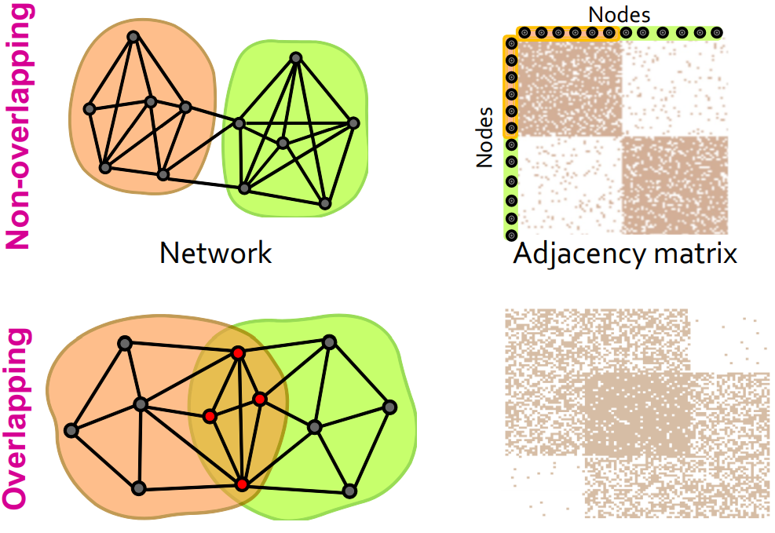

# 网络中的社团结构(CS224W 图机器学习)
## 🌎网络社团(Network Communities)
### 网络社团的基础概念和实例
+ 概念: 具有大量内部连接和很少外部连接(通往网络的其余部分)的节点集.
+ NCAA足球网络

	

---

### 模块度Q(Modularity Q)
+ 一种度量网络社区划分好坏的方法

+ 将网络划分为不相交的群组 $s \in S$:
$$Q \propto \sum_{s \in S}[(edges\  within\  group\ s) - (expected\ edges\  within\ group\ s)]$$
   + $(expected\ edges\  within\ group\ s)$ 表示的是一个基准图, 一般称之为零模型(Null Model).

---

### 零模型: 配置模型(Null Model: Configuration Model)
+ 给定真实网络$G$中的节点$n$和边$m$, 构造重新布线的网络$G^{'}$:
   
   + 与原网络具有相同的度分布, 但是每个边是均匀随机连接的.
   
   + 把图$G^{'}$看作一个多重图.
   
   + 度为$k_i$和$k_j$的节点$i$和节点$j$之间的期望边数(Expected numeber of edges)为:
   $$k_i \cdot \frac{k_j}{2m} = \frac{k_ik_j}{2m}$$
   + 期望边数的证明: 
       + 节点$i,j$中有边链接的覅率分布为$0-1$分布,则两节点之间的边数期望即为两节点之间存在边的概率.
       + 一条边选择某一个顶点进行连接时,该顶点的度决定了该节点被连接的概率大小. 所以两个节点$i,j$相连的概率可以表示为一条边同时连接两个节点$i,j$的概率,即$P_{ij} =F(k_ik_j)$($F$为顶点的函数, 表示一条边连接度为$k_i$的节点$i$的概率). 同时,由于一个边连接两个端点时进行的选择是相互独立的,两节点想连的概率又可以表示为$P_{ij} =F(k_i)F(k_j)$.

    $$P_{vw} = F(k_v)F(k_w)$$
    $$\sum_{w} P_{vw} = \sum_{w}F(k_v)F(k_w) = F(k_v)\sum_{w}F(k_w)$$
    $$\sum_{w}p_{vw} = k_v \rightarrow F(k_v)\sum_{w}F(k_w) = k_v$$ 
    $$\sum_{v}p_{vw} = k_w \rightarrow F(k_w)\sum_{v}F(k_v) = k_w$$
    $$F(k_v) = \frac{k_v}{\sum_{w}F(k_w)} = C_1\cdot k_v$$
    $$F(k_w) = \frac{k_w}{\sum_{v}F(k_v)} = C_2\cdot k_w$$
    $$\sum_{vw}p_{vw} = 2m$$
    $$\sum_{vw}F(k_v)F(k_w) = \sum_{v}F(k_v)\sum_{v}F(k_w) = \sum_{vw}C_1C_2k_vk_w = 2m$$
    $$C_1^2C_2^2(\sum_{vw}k_vk_w)^2 = (2m)^2 \rightarrow C_1C_2 = \frac{1}{2m}$$
    $$\Rightarrow$$
    $$p_{vw} = C_1C_2k_vk_w = \frac{k_vk_w}{2m}$$

   + 关于两节点间期望的边数的直观理解: 节点度的大小决定了边在选择节点时的概率大小,即节点的度越大, 边选择节点的概率越高. 两节点$i,j$(假设$k_i > 1, k_j > 1$)若被选择,则连接两个节点的边携带的度为2, 但是由于两个节点度大于1, 所以可以认为一条边选择节点$i,j$的次数有$k_i\cdot k_j$次, 再除以总的边数所携带的度,就是两节点之间存在边数的概率, 即两节点间边数的期望.

---

### 模块度计算

$$Q(G, S) = \frac{1}{2m}\sum_{s\in S}\sum_{i\in s}\sum_{j\in s}(A_{ij} - \frac{k_ik_j}{2m})$$

+ 等式右边的$\frac{1}{2m}$为正则化约束以保持$-1< Q <1$.
+ $A_{ij} = 1$, 当节点$i,j$之间有边相连时, 否则$A_{ij} = 0$.
+ 模块度取值范围为$[-1, 1]$
   + 如果组内的边数超过期望边数，则$Q$为正值
   + 当$Q$值大于0.3-0.7表示社团结构显著
+ 模块度公式的等效表示:
   + $\sigma$是一个指示函数. $\sigma(c_i, c_j) = 1\ if\ c_i = c_j\ ,else\ 0$
$$Q = \frac{1}{2m}\sum_{ij}[A_{ij} - \frac{k_ik_j}{2m}]\sigma(c_i, c_j)$$

---

## 🌎社团检测算法: louvain算法(Louvain Algorithm)
### louvain算法的简单介绍
+ 社团检测的贪婪算法
   + 时间复杂度为$O(nlogn)$, 耗费时间少.
+ 支持带权重的图.
+ 提供层级化的社团.

### louvain算法的第一阶段:分割(Partitioning)
+ 将图中的每一个节点看作一个独立的社团
+ 对于每一个节点$i$而言, 该算法执行下列两个计算过程:
   + 当把节点$i$加入其某一个邻居节点$j$的社团中时计算模块度的增量$\Delta Q$.
   + 移动节点$i$到在$\Delta Q$中产生最大增益的节点社团
+ 当达到模块度的局部极大值时, 即当没有单个节点移动可以改善模块度时, 第一阶段停止. 需要注意算法的输出取决于节点被考虑的顺序.同时研究表明,节点的排序对所获得的整体模块度没有显著影响.

+ 将节点$i$合并到社团$C$中时$\Delta Q$的计算:

   $$\Delta Q(i \rightarrow C) = [\frac{\sum_{in} + k_{i,in}}{2m} - (\frac{\sum_{tot}+k_i}{2m})^2] - [\frac{\sum_{in}}{2m} - (\frac{\sum_{tot}}{2m})^2 - (\frac{k_i}{2m})^2]$$

   + $\sum_{in}$ : 社团$C$中节点间连接权重之和(无权图中表示社团$C$中边的总数).

    

   
   + $\sum_{tot}$ : 与社团$C$内所有节点相连的边的权重之和(无权图中表示与社团$C$中所有节点相连的边的个数).

    

   + $k_{i, in}$ : 节点$i$和社团$C$中连边的权重之和(无权图中表示节点$i$和社团$C$相连的边数和).

   + $k_{i}$ : 节点$i$所有连边的权重之和(无权图中为节点的度).

   + 还需导出节点$i$脱离社区$D$的增量$\Delta Q(D\rightarrow i)$

   + 最终得到$\Delta Q = \Delta Q(i\rightarrow C) + (D\rightarrow i)$

    

### louvain算法的第二阶段:重组(Restructuring)
+ 在第一阶段获得的社区被收缩成超级节点, 并据此创建网络.
   + 如果在相应社区的节点之间至少存在一条边, 则两个超级节点是连通的.
   + 两个超级节点之间的边的权重是它们对应的社区之间所有边的权重之和.
+ 第一阶段的算法继续在这些超级节点构成的边上进行社区划分,得到更高聚合层次的社区.

    

    

---

## 🌎重叠社区检测: BigCLAM
### 基础构想
+ 前面提到的社区检测Louvain算法虽然应用很广, 但由该算法生成的社区不存在重叠重叠. 对于现在复杂的社会结构, 一个节点很可能存在于多个社区, 所以需要新的方法来计算图的重叠性.

   

+ 设计一个能生成重叠图的模型, 然后通过调整模型参数来拟合给定的图. 这个模型叫Community Affiliation Graph Model (AGM).

---

### 社团-AGM
+ 给定社团集合$G$, 节点集合$V$以及成员关系$M$表示某个节点属于某个或多个社区, 社区$c$内部的点互相连接的概率为$p_c$.
+ 任意两个节点互相连接的概率为:
$$p(u, v) = 1 - \prod_{c\in M_u\cap M_v}(1 - p_c)$$

---

### 基于AGM的社团检测
+ AGM 不仅能表示重叠, 还能表示嵌套的情况, 因此是个很有效的模型. 而现在我们要做的就是通过给定的网络结构反推 AGM 模型, 包括社区个数,节点与社区的隶属关系以及每个社区内的连接概率. 即给定图$G$, 找到模型$F$, 相当于最大化概率:

$$P(G|F) = \prod_{(u, v)\in G}\prod_{(u, v)\notin{G}}(1 - P(u, v))$$

+ 但是这种“有就是有，没有就是没有”的定义太死板了，需要松弛一下。所以给每个节点定义一个向量 Fμ 表示这个节点属于各个社区的权重(或概率)。这样就需要调整节点间连接的概率:

$$l(F) = \sum_{(u,v)\in E}log(1 - exp(-F_{
u}F_{v}^T)) - \sum_{(u,v)\notin{E}}F_{
u}F_{v}^T$$

+ 接下来要做的是:
   + 随机化初始化AGM的参数$F$
   + 固定其他节点的社团成员关系, 更新节点$u$