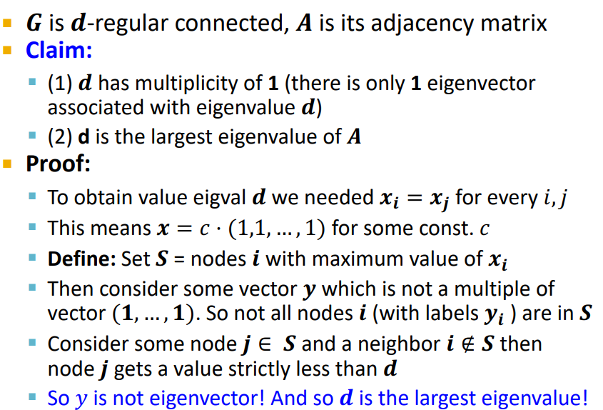

# 谱聚类(Spectral Clustering CS224W 图机器学习)
## 🌎谱聚类算法(Spectral Clustering Algorithm)
+ 在定义问题之间,先给出谱聚类的三个基本步骤:
   + 预处理(Pre-processing): 构造一个图的矩阵表达
   + 分解(Decomposition): 
      + 计算矩阵的特征值和特征向量
      + 将每个点映射到基于一个或多个特征向量的低维表示
   + 分组(Grouping): 根绝新的表示, 将节点分到2个或多个簇中.

---

## 🌎图分割(Graph Partitioning) 
### 朴素思考
+ 给定无向图$G(V,E)$: 

    

+ 考虑简单的二元分割问题:
   + 将节点分到两个互不连接的组$A, B$中:

    

+ 假设图中节点已经划分完毕, 那么要考虑的问题就是怎样来度量划分结果的好坏,即什么样的划分才是最有效的划分.

+ 对于一个好的划分的简单理解:
   + 最大化组内(witnin-group)的连接
   + 最小化组外(between-group)的连接

 

    
 

 ### 图切分(Graph Cuts)
 + 将分区目标表示为分区的"边切割(Edge cut)"函数.
 + 边的端点分别在不同组的边总数记为对两个组的切割(如果为带权图, 则要计算的是这些边权重的和):
 
 $$cut(A,B) = \sum_{i\in A,j\in B}W_{ij}$$

    
 

### 图切分准则(Graph cut Criterion)
+ 最小切分准则(minimum-cut Criterion)
   + 最小化组间连接的权重:
   $$arg\min_{A,B}\,cut(A,B)$$
   + 这种方法存在的问题是: 只考虑了外部的聚类连接而没有考虑内部的聚类连接. 根据该准则划分出的组大小不均匀的情况. 

    
 

 + 导电准则(Conductance Criterion)
   + 组之间的连通性与每个组的密度相关
   $$\phi (A,B) = \frac{A,B}{\min(vol(A),vol(B))}$$
   + $vol(A): A$中节点总的加权度(节点的强度)
   + $vol(A) = \sum_{i\in A}k_i$($A$中节点的度) 
   + 使用这个准则的好处是, 我们产生的分组相对于第一个准则而言更加平衡(如果$\min(vol(A),vol(B))$中的像上图所示为1, 那么这个分割就是不好的, 即这种分割方法会被否决掉).

---

## 🌎基于谱的图分割(Spectral Graph Partitioning)
+ 在了解了判别图分割好坏的标准后, 最重要的问题就是如何进行图分割,这里介绍基于谱的图分割.
### 推导之前:
+ $A$: 无向图$G$的邻接矩阵
   + $A_{ij} =1\,\, if(i,j)\, is\, an\, edge,\, else\, 0$

+ $x$是$\Re^n$向量空间中的一个向量

    
 

---

### $Ax$的含义
+ $A\cdot x$的第$j$个值:
    + 节点$j$邻居的$x-values$的和
    + 在节点$j$上生成一个新的$x-value$

+ 谱图理论
   + 分析表示图$G$的矩阵的谱
   + 谱: 图的特征向量$x^{i}$,按其相应特征值$\lambda_{i}$的大小(强度)排序
 

    
 

### 基于$d-Regular$图的分析
+ 假设$G$中所有的节点度均为$d$($G$是$d-Regular$的)并且$G$是连通图
+ 现令:$x = (1,1,...,1)$
+ 则: $A\cdot x = (d,d,...d) = \lambda \cdot x$
+ 求得$\lambda = d$
+ 这样我们就得到了关于图$G$的一个特征对:$x = (1,1,...1), \lambda = d$
+ $d$是邻接矩阵$A$的最大特征向量(证明见下图).

    
 

 ---

### 两个连通分量的分析
+ 考虑G不是一个连通图
   + 考虑$G$有两个连通分量, 且每个连通分量都是$d-regular$

+ 求其中的部分特征向量
   + $x =$与$C$连通分量相关的向量元素设置为1, 与$B$连通分量相关的向量元素设置为0, 反之亦然.
      + $x^{'} = (1,...,1,0,...0)^T, then\,\, A\cdot x^{'} = (d,...,d,0,...0)^T$
      + $x^{''} = (0,...0,1,...,1)^T, then\,\, A\cdot x^{''} = (0,...0,d,...,d)^T$
      + 所以在这两种情况下, 对应的$\lambda = d$

### 直觉思考:

    
 

+ 我们知道如果$d-regular$图是连通图那么对应的连通分量$x_n = (1,1,...,1)$是邻接矩阵的一个特征向量.
+ 因为特征向量之间是正交的, 所以除上述的$x_n$之外的$x_{n-1}$的和必定为1.
   + 因为特征向量之间正交,则容易得到$x_n^T\cdot x_{n-1} = 0$(点积为0).进一步的,$\sum_{i}x_n[i]\cdot x_{n-1}[i] =\sum_{i}x_{n-1}[i]=0$
   + $x_{n-1}$将节点切分为两个分组:
      + $x_{n-1}[i] > 0\,\, vs.\,\, x_{n-1}[i] < 0$
   + 所以我们原则上可以看第二大特征值的特征向量, 并在分组$C$中声明带有正标签的节点, 在分组$B$中声明负标签的节点.

---

### 矩阵表示
+ 邻接矩阵$A$:
   + $n*n$大小的矩阵
   + $A[a_{ij}], a_{ij} = 1\, if\, edge\, between\, node\, i\, and\, j$
    + 重要性质:
        + 对称矩阵
        + $n$个特征向量$(Rank(A) = n)$
        + 特征向量为实值且两两正交

    
 

+ 度矩阵$D$(Degree matrix)
   + $L = D - A$
   + $n*n$大小的矩阵
   + $D =[d_{ii}]$, $d_{ii}$是节点$i$的度

    
 

+ 拉普拉斯矩阵$L$(Laplacian matrix)
   + $n*n$大小的对称矩阵
   + $L$矩阵的重要性质:
      + 矩阵的特征值为非负实数
      + 特征向量是实的

    
 

+ $L$矩阵的性质
   + 所有的特征值大于0
   + 对所有的$x$, 有$x^TLx = \sum_{ij}L_{ij}x_ix_j \ge 0$
   + $L$是半正定的

---

### $\lambda_2$ as an Optimization Problem
+ 对于对称矩阵$M$而言:
$$\lambda_2  = \min_{x: x^Tw_1=0}\frac{x^TMx}{x^Tx}$$

+ 图$G$中$x^TLx$的含义:
   + $x^TLx = \sum_{i,j}^nL_{ij}x_ix_j = \sum_{i,j=1}^n(D_{ij}-A_{ij})x_ix_j$

   + = $\sum_iD_{ii}x_{i}^2 - \sum_{(i,j)\in E}2x_ix_j$

   + = $\sum_{(i,j)\in E}(x_i^2+x_j^2-2x_ix_j) = \sum_{(i,j)\in E}(x_i - x_j)^2$

   + 节点$i$的度为$d_{i}$, 所以$x_{i}^2$需要被求和$d_i$次. 又因为每个边$(i,j)$拥有2个端点, 五哦一我们需要$x_i^2+x_j^2$.

+ 证明最优化公式

    
 

---

### 求解$x$以解决$\lambda_2  = \min_{x: x^Tw_1=0}\frac{x^TMx}{x^Tx}$
+ $x$的性质:
   + $x$是一个单位向量:$\sum_{i}x_i^2 = 1$
   + $x$正交与第一个特征向量$(1,1...,1)$正交:$\sum_ix_i\cdot 1 = \sum_ix_i = 0$

   $$\lambda_2 = \min_{x: x^Tw_1=0}\frac{(x_i - x_j)^2}{\sum_ix_i^2}$$

+ 我们想要分配$x_i$给节点$i$这样只有为数不多的边会穿过0

    
 

---

### 再谈谱聚类算法
+ 1). 预处理
   + 构造图的$L$矩阵

    

+ 2). 分解
   + 计算的得出矩阵$L$的特征值和特征向量
   + 将顶点映射到$x_2$的相应分量上
   

    

+ 3). 分组
   + 降维向量分量的排序
   + 通过将分类向量一分为二来识别聚类

+ 分割点(Splitting point)的选择
   + 朴素方法:
      + 以0为分割点进行切分
   + 其他计算代价较大的方法:
      + 尝试最小化一维中的标准化切割

    

+ 可视化的分类实例

    

---

### 对图进行$k$聚类
+ 两个基本方法:
   + 递归的二元分割(Recursive bi-partitioning)[Hagen et al., '92]
      + 以分层除法递归地应用二元分割算法
      + 缺点: 效率低下, 分割效果不稳定
   + 聚类多个特征向量(Cluster multiple eigenvectors)[Shi-Malik, '00]
      + 从多个特征向量构建一个简化的空间
         + 每个节点都由$k$个数字表示
         + 根据节点的$k$维表示对节点进行聚类(应用k-means)
         + 该方法相较于上一个方法更好, 且在近年来的论文中被普遍应用

+ $k$的选择
   + Eigengap
      + 两个连续特征值之间的差
   + 最稳定的聚类通常是通过使得eigengap$\Delta_k$最大化的$k$值来确定:
   
   $$\Delta_k = |\lambda_k - \lambda_{k-
   1}|$$

   

      
   

---

## 🌎基于主题的谱聚类(Motif-Based SPectral Clustering)
### 主题模型(Modules of Motifs)
+ 寻找基于主题的模型

   

      
   

+ 不同的主题表现出不同的模块化结构
   

      
   

---

### 定义主题的电导(Defining Motif conductance)
+ 基于前述的电导含义, 可进行类比的电导相关概念的描述.

   

      
   

+ $vol_M(S)$表示的是在组$S$中对应主题的节点数量的和, 即$S$中的主题的个数 X 当前主题中的节点数量

+ 根据上图公式可以求得下图划分后的$\phi(S) = \frac{1}{10}$

   

      
   

### 优化主题电导性(Optimizing Motif Conductance)
+ 同前面的谱聚类一样, 基于主题的谱聚类的优化过程也分为三个步骤:
   + 1). 预处理
      + 将原图转化为带有特殊权重的图
      

         
      

      

         
      

   + 2). 分解
      + 使用标准的谱聚类
   + 3). 分组
      + 过程和标准的谱聚类一样
